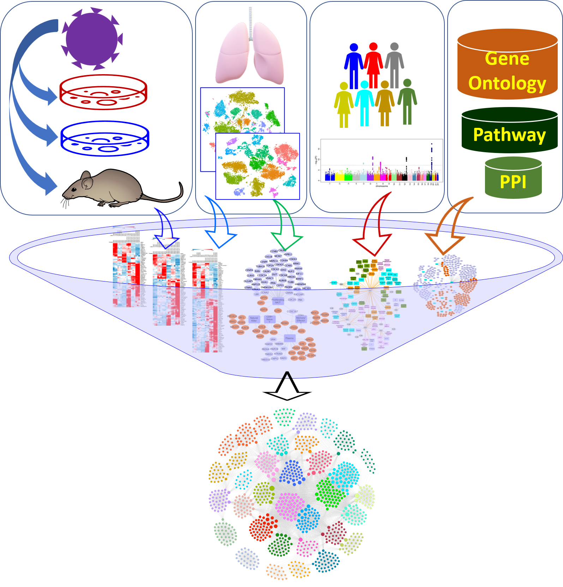

# COVID19_secondary_analysis
## Secondary analysis of transcriptomes of SARS-CoV-2 infection models to characterize COVID-19
 

This repository contains the various input files, generated outputs and scripts associated with our paper titled above. These scripts can be used to generate or reproduce the data published in our main text and other supplemental items. We also share the R objects and cytoscape (https://cytoscape.org/) session files associated with all the figures published in our work. The folder structure of this repository is described below:

* <u><b>input_data/</b></u>: This directory contains the various files used as inputs to our study

  * <u><b>Count data/</b></u> - Raw counts from the three SARS-CoV-2 studies (two <i>in vitro</i> models and one <i>in vivo</i> model) used in our research. In case of the two animal models, the corresponding human orthologs used are also available
  
  * <u><b>Lung Markers/</b></u> - Lung scRNA-seq markers from three different human lung studies utilized in our work.
  
  * <u><b>SARS-CoV-2 DEGs/</b></u> - Individual differentially expressed gene (DEG) lists identified from the three input studies. along with the consensus transcriptomic signature.Also included are the DEGs from nasopharyngeal swabs from human COVID-19 patients (GSE152075) and SARS-CoV-2 human interactants.
  
  * <u><b>other data/</b></u> - this folder contains gene-phenotype/trait associations (compressed files) from both GWAS Catalog (https://www.ebi.ac.uk/gwas/) and PheGenI (https://www.ncbi.nlm.nih.gov/gap/phegeni) used in our study.
  
* <u><b>Scripts/</b></u>: This directory includes the script files used in our analysis.
   
   * <u><b>GetConsensus.R</b></u> - To filter the differentially expressed gene (DEG) lists from each individual study and obtain a consensus transcriptomic signature. It has the following options:
      * <i> `--`files</i>: Comma-separated list of result files from differential expression analysis from RUVSeq. In this project we use the results from running the DifferentialExpression module in CSBB-v3.0 (https://github.com/praneet1988/Computational-Suite-For-Bioinformaticians-and-Biologists)
      * <i> `--`org_assemblies (optional)</i>: A comma-separated list of Ensembl assembly IDs, one for each input study. Used to identify and map the human ortholog gene symbols for studies with non-human samples. Valid assembly IDs can be found at https://uswest.ensembl.org/info/about/species.html. If not given, all gene symbols are assumed to belong to the same organism.
      * <i> `--`logFC</i>: A log2fc threshold value for filtering significant DEGs in each individual study (<i>default value</i> = 0.6)
      * <i> `--`pvalue</i>: A p-value (FDR corrected) threshold for filtering significant DEGs (<i>default value</i> = 0.6)
      * <i> `--`k</i>: Genes upregulated or downregulated in <i>k</i> or more studies are considered to be part of the consensus signature (<i>default value</i> = 2)
      * <i>`--`outpath</i>: Path to the output directory where the consensus DEGs will be written to.
   
   * <u><b>MCL_Clustering.R</b></u>: To build an interaction-network of consensus DEGs and run the Markov clustering (MCL) algorithm for identifying perturbed protein modules from a given set of DEGs. The options for this script include:
      * <i>`--`deg_file</i>: A file containing the consensus DEGs and the virus-host interactome (if used). Must include one gene per each line.
      * <i>`--`PPI_file (Optional)</i>: A tab-delimited file containing the set of human PPI. The latest version of STRING human PPIs can be downloaded from https://string-db.org/cgi/download?species_text=Homo+sapiens. Alternatively, interactions from other sources can also be used. If not given, this script uses the filtered STRING PPIs used in our project.
      * <i>`--`filter </i>: A condition to filter the PPI links prior to running the clustering algorithm. In this study, we only retained the interactions with a <i>combined_score</i> ≥ 0.9 or <i>experimental_score</i> ≥ 0.7
      * <i> `--`inflation_value</i>: Inflation parameter in MCL algorithm (<i>default value</i> = 2.5)
      * <i>`--`max_iter</i>: Maximum number of iterations for the MCL algorithm (<i>default value</i> = 100)
      * <i>`--`outpath</i>: Path to the output directory where the file containing the final MCL cluster memberships will be stored.
   
   * <u><b>Marker_enrichments.R</b></u>: To compute cell type marker enrichments among a given set of candidate gene modules. Supported options for this script are:
      * <i>`--`marker_file</i>: Text file containing cell type marker genes. It should contain 4 mandatory columns corresponding to the cell type ("cell"), gene marker ("gene"), fold change ("logFC") and the adjusted p-value ("pval_adj").
      * <i>`--`cluster_file</i>: A two-column, tab-delimited file containing genes (first column) and their corresponding MCL cluster memberships (second column).
      * <i>`--`outpath</i>: Path to the output directory.
      
   * <u><b>GWAS_enrichments.py</b></u>: To compute enrichments of phenotypic traits compiled from NHGRI-EBI GWAS Catalog database (https://www.ebi.ac.uk/gwas/home). Before performing the enrichment analysis, the experimental factor ontology (EFO) tree is parsed to obtain the child term (and its associations) for each of the GWAS Catalog traits. The EFO OBO file can be found at https://www.ebi.ac.uk/efo/efo.obo while the latest version of GWAS Catalog associations are available at https://www.ebi.ac.uk/gwas/docs/file-downloads.
      * <i>`--`obo_file</i> Path to the EFO OBO file (.txt).
      * <i>`--`assoc_file</i>: A tab-delimited file containing the GWAS Catalog associations.
      * <i>`--`cluster_file</i>: A two-column, tab-delimited file containing genes (first column) and their corresponding MCL cluster memberships (second column).
      * <i>`--`remove_intergenic</i>: A Boolean flag to indicate whether to remove the intergenic associations.
      * <i>`--`outpath</i>: Path to the output directory
   
   * <u><b>PheGenI_enrichments.R</b></u>: To compute module enrichments among the NCBI PheGenI (https://www.ncbi.nlm.nih.gov/gap/phegeni) traits. The allowed options include:
      * <i>`--`assoc_file</i>: A tab-delimited file containing phenotype-genotype associations from NCBI PheGenI.
      * <i>`--`cluster_file</i>: A two-column, tab-delimited file containing genes (first column) and their corresponding MCL cluster memberships (second column).
      * <i>`--`p_value</i>: A p-value threshold for filtering associations (<i>default value</i> = 1e-05).
      * <i>`--`remove_intergenic</i>: A Boolean flag to indicate whether to remove the intergenic associations.
      * <i>`--`outpath</i>: Path to the output directory
   
   * <u><b>Miscellaneous scripts</b></u>:
      * <u>COVID_enrichments.R</u> - Useful for producing the Supplemental tables from our work.
      * <u>Utils.R</u> - Contains helper functions used in our enrichment analysis script.
      * <u>COVID_benchmarking.R</u> - Randomized trials conducted to test the robustness of individual DEGs and the consensus transcriptome from the three input disease models used in our framework. Also included are the experiments used to validate the level of connectivity observed among the consensus signature along with their interactions with the SARS-CoV-2 virus-host interactants.

* <u><b>RData/</b></u> - R objects to reproduce the results from our benchmarking experiments.

* <u><b>Figures_data/</b></u> - Contains the cytoscape session files to generate the network figures (both main and Supplemental) presented in our work. These session objects also contain the input networks that were used to generate the visualizations

  